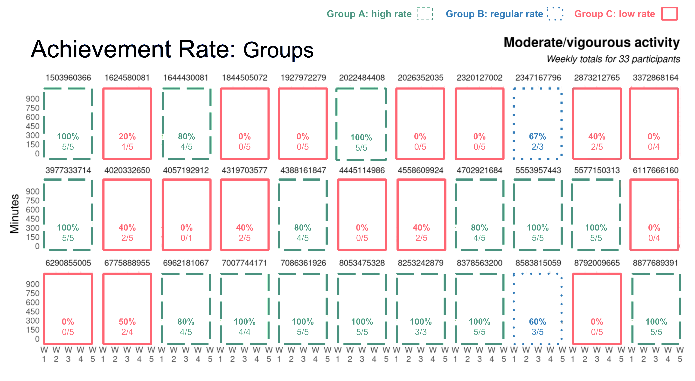

# ASK

## Introduction

Bellabeat produces health-focused smart products with beautifully designed technology tailored to women's needs, offering users insights into their activity, sleep, stress, and reproductive health, empowering them with valuable knowledge. While Bellabeat has become a leading tech-driven wellness brand for women, founder Urška Sršen recognizes the potential for fresh growth opportunities through consumer insights, and has tasked the marketing analytics team with delving into smart device usage data to shape Bellabeat's marketing strategy.

## Stakeholders

#### Primary

-   **Urška Sršen**: Bellabeat’s co-founder and Chief Creative Officer
-   **Sando Mur**: Mathematician and Bellabeat’s co-founder; key member of the Bellabeat executive team

#### Secondary

-   **Bellabeat marketing analytics team**: A team of data analysts responsible for collecting, analyzing, and reporting data that helps guide Bellabeat’s marketing strategy.

## Guiding questions

These questions will guide the analysis:

1.  What are some trends in smart device usage?

2.  How could these trends apply to Bellabeat customers?

3.  How could these trends help influence Bellabeat marketing strategy?

## Business task

+----------------------------------------------------------------------------------------------------------------------------------------------------------+
| ### Analyze smart device fitness data to gain insight into consumer behavior and identify usage trends that can inform Bellabeat app marketing strategy. |
+----------------------------------------------------------------------------------------------------------------------------------------------------------+

# PREPARE

## Using R

We'll be using R via RStudio for our analysis as it offers numerous advantages due to its robust statistical capabilities and extensive collection of packages for data manipulation, visualization, and modeling. RStudio has an intuitive interface, seamless integration with R, and a comprehensive suite of tools that streamline workflow. R Markdown is also a fantastic tool for presenting data analysis projects because it seamlessly integrates code, visualizations, and narrative text, making it easy to share a comprehensivereport of your analysis process and findings in one place.

## Installing and loading packages

We'll start by installing the following packages:

```{r install-packages, eval=FALSE}
#install.packages("tidyverse")
install.packages(c(
  "tidyr", "dplyr", "knitr", "skimr", "stringr", "hms", "janitor", "lubridate", "ggplot2", "ggthemes", "ggforce", "gridExtra", "patchwork", "paletteer", "crayon", "sqldf", "plotrix"
))
devtools::install_github("nsgrantham/ggdark")
```

And then loading them:

```{r load-libraries, message=FALSE}
# Load libraries ----
library("tidyverse")
library("tidyr") 
library("dplyr")  
library("knitr")   
library("skimr")
library("stringr")
library("hms")
library("janitor")
library("lubridate")
library("ggplot2") 
library("ggthemes")
library("ggdark")
library("ggforce")
library("gridExtra")
library("patchwork")
library("paletteer")
library("crayon")       
library("sqldf")
library("plotrix")
```

## Data source

We'll be using the following data: [**FitBit Fitness Tracker Data**](https://www.kaggle.com/arashnic/fitbit) (CC0: Public Domain, available via [Mobius](https://www.kaggle.com/arashnic)). This Kaggle dataset contains personal fitness tracker data from thirty FitBit users. It includes information about daily activity, steps, and heart rate that can be used to explore users’ habits. The dataset contains 18 CSV files organized in long format.

Let's consider: Does our data ROCCC?

-   **Reliable** - LOW: 30 individuals is a very small sample size that is not representative of the entire population of FitBit users.

-   **Original** - LOW: Amazon Mechanical Turk is a third-party data source.

-   **Comprehensive** - MED: The dataset contains a wide range of physical fitness data from the participants, but lacks demographic data to make meaningful marketing insights.

-   **Current** - LOW: This data is from March 2016 through May 2016. The data is from over *7 years ago*— quite old.

-   **Cited** - LOW: Data was collected from a third party.

As we can see, the strength of this data is pretty low across the board— not ideal for analysis. The scenario prompt suggests adding another dataset to help address the limitations of this one, but after searching various databases I have found no other datasets that have comparable data.

## Looking at the data

We'll be delving into data spread across fourteen CSV files (tossed four due to having the same data as other files, but in narrow format rather than wide). The data is structured, organized in rows and columns. Most datasets are in long format, with each row corresponding to one time point per session ID, and each session ID having multiple rows of data. Reports can be parsed by export ID or timestamp. These datasets are categorized based on the time increments they were tracked by: **daily**, **hourly**, and **minute** data. Analyzing data at these different levels allows us to uncover trends and insights applicable to Bellabeat customers.

Let's take a look at file sizes to see what we want to import so as to not overload RStudio.

```{r preview-file-size, echo=FALSE}
# Daily data ----
cat("dailyActivity_merged.csv", "=", file.info("fitbitdata/dailyActivity_merged.csv")$size, "bytes", sep = " ", fill = TRUE)
cat("dailyCalories_merged.csv", "=", file.info("fitbitdata/dailyCalories_merged.csv")$size, "bytes", sep = " ", fill = TRUE)
cat("dailyIntensities_merged.csv", "=", file.info("fitbitdata/dailyIntensities_merged.csv")$size, "bytes", sep = " ", fill = TRUE)
cat("dailySteps_merged.csv", "=", file.info("fitbitdata/dailySteps_merged.csv")$size, "bytes", sep = " ", fill = TRUE)
cat("sleepDay_merged.csv", "=", file.info("fitbitdata/sleepDay_merged.csv")$size, "bytes", sep = " ", fill = TRUE)
cat("weightLogInfo_merged.csv", "=", file.info("fitbitdata/weightLogInfo_merged.csv")$size, "bytes", sep = " ", fill = TRUE)
# Hourly data ----
cat("hourlyCalories_merged.csv", "=", file.info("fitbitdata/hourlyCalories_merged.csv")$size, "bytes", sep = " ", fill = TRUE)
cat("hourlyIntensities_merged.csv", "=", file.info("fitbitdata/hourlyIntensities_merged.csv")$size, "bytes", sep = " ", fill = TRUE)
cat("hourlySteps_merged.csv", "=", file.info("fitbitdata/hourlySteps_merged.csv")$size, "bytes", sep = " ", fill = TRUE)
# Minute data ----
cat("minuteCaloriesNarrow_merged.csv", "=", file.info("fitbitdata/minuteCaloriesNarrow_merged.csv")$size, "bytes", sep = " ", fill = TRUE)
cat("minuteIntensitiesNarrow_merged.csv", "=", file.info("fitbitdata/minuteIntensitiesNarrow_merged.csv")$size, "bytes", sep = " ", fill = TRUE)
cat("minuteMETsNarrow_merged.csv", "=", file.info("fitbitdata/minuteMETsNarrow_merged.csv")$size, "bytes", sep = " ", fill = TRUE)
cat("minuteSleep_merged.csv", "=", file.info("fitbitdata/minuteSleep_merged.csv")$size, "bytes", sep = " ", fill = TRUE)
cat("minuteStepsNarrow_merged.csv", "=", file.info("fitbitdata/minuteStepsNarrow_merged.csv")$size, "bytes", sep = " ", fill = TRUE)
```

The files of the datasets taken per minute are much too big to handle— the smallest minute file `minuteSleep_merged.csv` comes in at 8848370 bytes, almost 10 times larger than the largest hourly file `hourlyIntensities_merged.csv` at 898778 bytes. It is then best to focus on the daily and hourly datasets, which we load below.

```{r load-datasets, message=FALSE, results="hide"}
daily_activity <- read_csv("fitbitdata/dailyActivity_merged.csv")
daily_calories <- read_csv("fitbitdata/dailyCalories_merged.csv")
daily_intensities <- read_csv("fitbitdata/dailyIntensities_merged.csv")
daily_steps <- read_csv("fitbitdata/dailySteps_merged.csv")
daily_sleep <- read_csv("fitbitdata/sleepDay_merged.csv")
weight_log <- read_csv("fitbitdata/weightLogInfo_merged.csv")
hourly_calories <- read_csv("fitbitdata/hourlyCalories_merged.csv")
hourly_intensities <- read_csv("fitbitdata/hourlyIntensities_merged.csv")
hourly_steps <- read_csv("fitbitdata/hourlySteps_merged.csv")

```

We'll also load the smallest minute dataset.

```{r load-datasets-2, message=FALSE, results="hide"}
minute_sleep <- read_csv("fitbitdata/minuteSleep_merged.csv")
```

# PROCESS

## Cleaning the data

Let's clean the data in the ten datasets we've chosen to use.

### Creating tibbles {.tabset .tabset-fade}

We're going to use `head()` to get a glimpse of the data structure and content to get a better initial understanding of the variables and values at hand:

#### Daily Dataframes

`head(daily_activity)`

```{r preview-daily-activity, echo=FALSE}
head(daily_activity)
```

`head(daily_calories)`

```{r preview-daily-calories, echo=FALSE}
head(daily_calories)
```

`head(daily_intensities)`

```{r preview-daily-intensities, echo=FALSE}
head(daily_intensities)
```

`head(daily_steps)`

```{r preview-daily-steps, echo=FALSE}
head(daily_steps)
```

`head(daily_sleep)`

```{r preview-sleep-day, echo=FALSE}
head(daily_sleep)
```

`head(weight_log)`

```{r preview-weight-log, echo=FALSE}
head(weight_log)
```

#### Hourly Dataframes

`head(hourly_calories)`

```{r preview-hourly-calories, echo=FALSE}
head(hourly_calories)
```

`head(hourly_intensities`

```{r preview-hourly-intensities, echo=FALSE}
head(hourly_intensities)
```

`head(hourly_steps)`

```{r preview-hourly-steps, echo=FALSE}
head(hourly_steps)
```

#### Minute Dataframe

`head(minute_sleep)`

```{r preview-minute-sleep, echo=FALSE}
head(minute_sleep)
```

### Column names {.tabset .tabset-fade}

Let's use `colnames()` to get an even better idea of our data:

#### Daily Dataframes

`colnames(daily_activity)`

```{r daily-activity-colnames, echo=FALSE}
  colnames(daily_activity)
```

`colnames(daily_calories)`

```{r daily-calories-colnames, echo=FALSE}
colnames(daily_calories)
```

`colnames(daily_intensities)`

```{r daily-intensities-colnames, echo=FALSE}
colnames(daily_intensities)
```

`colnames(daily_steps)`

```{r daily-steps-colnames, echo=FALSE}
colnames(daily_steps)
```

`colnames(daily_sleep)`

```{r sleep-day-colnames, echo=FALSE}
colnames(daily_sleep)
```

`colnames(weight_log)`

```{r weight-log-colnames, echo=FALSE}
colnames(weight_log)
```

#### Hourly Dataframes

`colnames(hourly_calories)`

```{r hourly-calories-colnames, echo=FALSE}
colnames(hourly_calories)
```

`colnames(hourly_intensities)`

```{r hourly-intensities-colnames, echo=FALSE}
colnames(hourly_intensities)
```

`colnames(hourly_steps)`

```{r hourly-steps-colnames, echo=FALSE}
colnames(hourly_steps)
```

#### Minute Dataframe

`colnames(minute_sleep)`

```{r minute-sleep-colnames, echo=FALSE}
colnames(minute_sleep)
```

### View variables to merge on {.tabset .tabset-fade}

We'll lastly be looking at the `Id` column and time/date variables for parallels, keeping in mind time/date variable format will be different between the dataframes.

#### Daily Dataframes

```{r select-daily-datasets}
daily_activity %>%
  select(Id, ActivityDate)
daily_calories %>%
  select(Id, ActivityDay)
daily_intensities %>%
  select(Id, ActivityDay)
daily_steps %>%
  select(Id, ActivityDay)
daily_sleep %>%
  select(Id, SleepDay)
weight_log %>%
  select(Id, Date)
```

Looking at the column names and row counts, it seems that all data contained in dataframes `daily_calories`, `daily_intensities`, and `daily_steps` are already contained in `daily_activity`, and upon further investigation, this is the case. Let's remove them:

```{r remove-daily-dfs}
rm("daily_calories", "daily_intensities", "daily_steps")
```

Since we can see the `weight_log` dataframe only contains 67 observations, let's look a little harder at it:

```{r weight-log-id}
weight_log %>%
  count(Id)
```

There are only 8 users that self-report their weight anywhere from once to thirty times, rendering it unusable— too little users, too much variance in report frequencies, too little time for significant change. Let's scrub it:

```{r remove-weight-log, eval=FALSE}
rm("weight_log")
```

#### Hourly Dataframes

```{r select-hourly-datasets}
hourly_calories %>%
  select(Id, ActivityHour)
hourly_intensities %>%
  select(Id, ActivityHour)
hourly_steps %>%
  select(Id, ActivityHour)
```

#### Minute Dataframe

```{r select-minute-datasets}
minute_sleep %>%
  select(Id, date)
```

### 

We can see some time/date formatting inconsistencies between the dataframes, which will be addressed below, and varying numbers of data rows per unique `Id`.

After removing some dataframes, we are left with the following:

-   `daily_activity`

-   `daily_sleep`

-   `hourly_calories`

-   `hourly_intensities`

-   `hourly_steps`

-   `minute_sleep`

### Data cleaning {.tabset .tabset-fade}

Having gotten to know the data, we can now pinpoint several data cleaning tasks to proceed with. Here are the primary areas we will focus on:

1.  **Standardize naming conventions:** we'll adjust the variable names in adherence to the [tidyverse style guide](https://style.tidyverse.org/syntax.html). All variable names will use only lowercase letters and underscores `_` (known as snake case) to separate words within a name. This will enhance code readability.

2.  **Standardize date formatting:** we'll make the date-time format consistent across the dataframes. This will help avoid potential issues in subsequent analysis and when we start merging the data.

3.  **Create new variables:** we'll create new columns for analysis in each dataframe.

4.  **Create merged sleep dataframe:** to better analyze the `minute_sleep` data, we'll have to do some transformation by reformatting and creating new variables, and aggregate all the sleep data we have into one dataframe.

#### Daily Dataframes

```{r format-daily-data, message=FALSE, warning=FALSE}
# daily_activity ----
daily_activity <-
  daily_activity %>% 
  rename(
    date = ActivityDate, 
    total_steps = TotalSteps, 
    total_distance = TotalDistance,
    tracker_distance = TrackerDistance,
    logged_activities_d = LoggedActivitiesDistance,
    very_active_d = VeryActiveDistance, 
    moderately_active_d = ModeratelyActiveDistance, 
    light_active_d = LightActiveDistance, 
    sedentary_d = SedentaryActiveDistance, 
    very_active_m = VeryActiveMinutes, 
    moderately_active_m = FairlyActiveMinutes, 
    lightly_active_m = LightlyActiveMinutes, 
    sedentary_m = SedentaryMinutes, 
    calories = Calories
  ) %>% 
  rename_with(
    tolower, starts_with("Id")
  ) %>% 
  mutate(
    # reformat variable as POSIXct
    date = parse_date_time(date, "%m/%d/%y"),
    # create new date only variable
    date_ymd = as.Date(date, "%Y/%m/%d"),
    # create new DOW and TOW variables
    day_of_week = weekdays(as.Date(date)),
    part_of_week = case_when(
      day_of_week %in% c("Monday", "Tuesday", "Wednesday", "Thursday", "Friday") ~ "Weekday", 
      day_of_week %in% c("Saturday", "Sunday") ~ "Weekend")
  )
# daily_sleep ----
daily_sleep <-
  daily_sleep %>% 
  rename(
    date = SleepDay,
    total_sleep_records = TotalSleepRecords,
    total_minutes_asleep = TotalMinutesAsleep,
    total_time_in_bed = TotalTimeInBed
  ) %>% 
   rename_with(
    tolower, starts_with("Id")
  ) %>% 
  mutate(
    date = parse_date_time(date, "%m/%d/%Y %I:%M:%S %p"),
    date_ymd = as.Date(date, "%Y/%m/%d"),
    day_of_week = weekdays(as.Date(date)),
    part_of_week = case_when(
      day_of_week %in% c("Monday", "Tuesday", "Wednesday", "Thursday", "Friday") ~ "Weekday", 
      day_of_week %in% c("Saturday", "Sunday") ~ "Weekend")
  )
```

#### Hourly Dataframes

```{r format-hourly-data, message=FALSE, warning=FALSE}
# hourly_calories ----
hourly_calories <-
  hourly_calories %>% 
  rename(
    hour = ActivityHour,
    calories = Calories
  ) %>% 
   rename_with(
    tolower, starts_with("Id")
  ) %>% 
  mutate(
    hour = parse_date_time(hour, "%m/%d/%Y %I:%M:%S %p"),
    date_ymd = as.Date(hour, "%Y/%m/%d"), 
    time = format(hour, format = "%I:%M:%S %p"),
    day_of_week = weekdays(as.Date(hour)),
    part_of_week = case_when(
      day_of_week %in% c("Monday", "Tuesday", "Wednesday", "Thursday", "Friday") ~ "Weekday", 
      day_of_week %in% c("Saturday", "Sunday") ~ "Weekend"),
    hour_of_day = as.POSIXct(time, format = "%I:%M:%S %p")
  )
# hourly_intensities ----
hourly_intensities <- 
  hourly_intensities %>% 
  rename(
    hour = ActivityHour,
    total_intensity = TotalIntensity,
    average_intensity = AverageIntensity
  ) %>% 
   rename_with(
    tolower, starts_with("Id")
  ) %>% 
  mutate(
    hour = parse_date_time(hour, "%m/%d/%Y %I:%M:%S %p"),
    date_ymd = as.Date(hour, "%Y/%m/%d"), 
    time = format(hour, format = "%I:%M:%S %p"),
    day_of_week = weekdays(as.Date(hour)),
    part_of_week = case_when(
      day_of_week %in% c("Monday", "Tuesday", "Wednesday", "Thursday", "Friday") ~ "Weekday", 
      day_of_week %in% c("Saturday", "Sunday") ~ "Weekend"),
    hour_of_day = as.POSIXct(time, format = "%I:%M:%S %p")
  )
# hourly_steps ----
hourly_steps <- 
  hourly_steps %>% 
  rename(
    hour = ActivityHour,
    step_total = StepTotal
  ) %>% 
   rename_with(
    tolower, starts_with("Id")
  ) %>% 
  mutate(
    hour = parse_date_time(hour, "%m/%d/%Y %I:%M:%S %p"),
    date_ymd = as.Date(hour, "%Y/%m/%d"), 
    time = format(hour, format = "%I:%M:%S %p"),
    day_of_week = weekdays(as.Date(hour)),
    part_of_week = case_when(
      day_of_week %in% c("Monday", "Tuesday", "Wednesday", "Thursday", "Friday") ~ "Weekday", 
      day_of_week %in% c("Saturday", "Sunday") ~ "Weekend"),
    hour_of_day = as.POSIXct(time, format = "%I:%M:%S %p")
  )
```

#### Minute Dataframes

```{r format-minute-data, message=FALSE, warning=FALSE}
# minute_sleep ----
minute_sleep <-
  minute_sleep %>% 
  rename(
    sleep_value = value,
    log_id = logId
  ) %>% 
   rename_with(
    tolower, starts_with("Id")
  ) %>% 
  mutate(
    date = parse_date_time(date, "%m/%d/%Y %I:%M:%S %p"),
    date_ymd = as.Date(date, "%Y/%m/%d"),
    time = format(date, format = "%I:%M:00 %p"), 
    day_of_week = weekdays(as.Date(date)),
    part_of_week = case_when(
      day_of_week %in% c("Monday", "Tuesday", "Wednesday", "Thursday", "Friday") ~ "Weekday", 
      day_of_week %in% c("Saturday", "Sunday") ~ "Weekend"),
    hour_of_day = as.POSIXct(time, format = "%I:%M:%S %p"),
    # sleep_id will be used generate totals per sleep log
    sleep_id = str_c(id, "-", log_id), 
    # Create new variables for sleep values - asleep, restless, and awake
    asleep = ifelse(sleep_value == 1, 1, 0),
    restless = ifelse(sleep_value == 2, 1, 0),
    awake = ifelse(sleep_value == 3, 1, 0)
  )
# Create sleep_summary_0 df ----
# shows totals for 3 sleep values per sleep log
sleep_summary_0 <-
  minute_sleep %>%
  # id_date will be used to generate a daily total
  mutate(
    id_date = str_c(id, "-", date_ymd)
  ) %>% 
  group_by(sleep_id, date_ymd, id_date, id) %>% 
  dplyr::summarize(
    total_asleep = sum(sleep_value == "1"),
    total_restless = sum(sleep_value == "2"),
    total_awake = sum(sleep_value == "3")
  )
# Create sleep_summary df ----
# that combines totals for each day per id
sleep_summary <-
  sleep_summary_0 %>%
  # date will be used to merge with daily_sleep df
  mutate(
    date = parse_date_time(date_ymd, "%Y/%m/%d")
  ) %>%
  group_by(id_date, date, id) %>%
  dplyr::summarize(
    total_asleep_merged = sum(total_asleep),
    total_restless_merged = sum(total_restless),
    total_awake_merged = sum(total_awake)
  )
# Merge these two daily sleep dfs into one ----
sleep_data <- merge(x = daily_sleep, y = sleep_summary, by = c("id", "date"), all = TRUE)
```

# ANALYZE

## Summary statistics

Now that we've done some cleaning and formatting, we can look at this data from a broad perspective. We'll do this by obtaining summary statistics that provide an overview of how the dataframes interrelate and potentially reveal trends within each.

### Unique participants {.tabset .tabset-fade}

#### Daily Dataframes

```{r distinct-daily-data}
# There are 33 users in the daily activity dataframe
n_distinct(daily_activity$id)
# There are 24 users in the sleep dataframes
n_distinct(daily_sleep$id)
n_distinct(sleep_data$id)
```

#### Hourly Dataframes

```{r distinct-hourly-data}
# There are 33 users in the hourly dataframes
n_distinct(hourly_calories$id)
n_distinct(hourly_intensities$id)
n_distinct(hourly_steps$id)
```

#### Minute Dataframe

```{r distinct-minute-data}
# There are 24 users in the minute dataframe
n_distinct(minute_sleep$id)
```

### Total number of observations {.tabset .tabset-fade}

#### Daily Dataframes

The observation counts vary between the daily dataframes:

```{r observations-daily-data}
nrow(daily_activity)
nrow(daily_sleep)
nrow(sleep_data)
```

#### Hourly Dataframes

There are 22099 observations in each hourly dataframe:

```{r observations-hourly-data}
nrow(hourly_calories)
nrow(hourly_intensities)
nrow(hourly_steps)
```

#### Minute Dataframe

There are 188521 observations in the minute dataframe:

```{r observations-minute-data}
nrow(minute_sleep)
```

### Overview {.tabset .tabset-fade}

#### Daily Dataframes

```{r summary-stats-daily-data, message=FALSE}
# Daily totals for steps, distance, calories ----
daily_activity %>%
  select(
    total_steps,
    total_distance,
    calories
  ) %>%
  summary()
# Minutes per activity level ----
daily_activity %>%
  select(
    very_active_m,
    moderately_active_m,
    lightly_active_m,
    sedentary_m
  ) %>%
  summary()
# Sleep totals ----
sleep_data %>%
  select(
    total_minutes_asleep, 
    total_time_in_bed,
    total_asleep_merged,
    total_restless_merged,
    total_awake_merged
  ) %>%
  summary()
```

#### Hourly Dataframes

```{r summary-stats-hourly-data, message=FALSE}
# Hourly calories summary ----
hourly_calories %>%
  select(calories) %>%
  summary()
# Hourly intensities summary ----
hourly_intensities %>%
  select(
    total_intensity,
    average_intensity
  ) %>%
  summary()
# Hourly steps summary ----
hourly_steps %>%
  select(step_total) %>%
  summary()
```

#### Minute Dataframe

```{r summary-stats-minute-data, message=FALSE}
# Minute sleep summary ----
minute_sleep %>%
  select(
    sleep_value,
    asleep,
    restless,
    awake
  ) %>%
  summary()
```

### Some findings

What does this tell us about this sample of people's activities? A few interesting things:

-   **7,638** – average total steps per day, which is below the generally recommended 10,000 goal.
-   **991.2** – average "Sedentary" minutes per day; this is just over 16.5 hours per day.
-   **192.8** – average "Lightly Active" minutes per day.
-   **34.72** – combined daily average of "Very Active" (21.16) and "Moderately Active" (13.56) minutes per day. This indicates that, on average, these individuals may be just about getting the [WHO recommended](https://www.who.int/publications/i/item/9789241599979) 150 minutes of moderate-intensity physical activity per week.
-   **91.5%** – average percentage of time asleep while in bed. This is calculated by dividing "Total Minutes Asleep" (419.5) by "Total Time In Bed" (458.6).
-   **97.39** – average calories burned per hour.

## Plotting a few explorations

### Steps and active minutes

The goal of 10,000 steps per day has been widely proposed across the smart device industry, but is daily step count truly a good metric of health? Let's consider the relationship between total steps and calories burned:

```{r total-steps-vs-calories, message=FALSE}
# Total steps vs calories plot ----
ggplot(data = daily_activity, aes(x = total_steps, y = calories)) +
  geom_point() +
  geom_smooth(method = "lm") + # Linear trendline with 95% confidence interval
  labs(title = "Total steps vs. calories burned") +
  xlab("Total Steps") +
  ylab("Calories") +
  theme_minimal()
cor.test(daily_activity$total_steps, daily_activity$calories, method = "pearson")
```

We see a positive correlation here between `total_steps` and `calories`. This can be expected; the more active someone is, the more calories they will burn. Let's further consider the relationship between `very_active_m` and `calories`:

```{r very-active-minutes-vs-calories, message=FALSE}
# Very active minutes vs calories plot ----
ggplot(data = daily_activity, aes(x = very_active_m, y = calories)) +
  geom_point() +
  geom_smooth(method = "lm") + # Linear trendline with 95% confidence interval
  labs(title = "Very active minutes vs. calories burned") +
  xlab("Very active minutes") +
  ylab("Calories") +
  theme_minimal()
cor.test(daily_activity$very_active_m, daily_activity$calories, method = "pearson")
```

Yet again we see another positive correlation. Very active people burn more calories. We know from our earlier summary statistics that the average `very_active_m` per day of `21.16` minutes is significantly lower than the average `lightly_active_m` per day of `192.80` minutes. Let's look at the relationship between `lightly_active_m` and `calories`:

```{r lightly-active-minutes-vs-calories, message=FALSE}
# Lightly active minutes vs calories plot ----
ggplot(data = daily_activity, aes(x = lightly_active_m, y = calories)) +
  geom_point() +
  geom_smooth(method = "lm") + # Linear trendline with  95% confidence interval
  labs(title = "Lightly active minutes vs. calories burned") +
  xlab("Lightly active minutes") +
  ylab("Calories") +
  theme_minimal()
cor.test(daily_activity$lightly_active_m, daily_activity$calories, method = "pearson")
```

We see the degradation of strength in the relationship between `lightly_active_m` and `calories`. The correlation is still positive, albeit much weaker and possibly even negligible. This may indicate `lightly_active_m` has less of an impact on calories burned throughout a day.

### Daily calories

Let's look at the relationship between calories and day of the week:

```{r daily-calories-vs-day-of-week}
# Create limits for plot ----
limits_weekdays <- c(
  "Monday", "Tuesday", "Wednesday", "Thursday", "Friday",
  "Saturday", "Sunday"
  )
# Calories vs day of week plot ----
ggplot(data = daily_activity) +
  geom_point(
    aes(x = day_of_week, y = calories, color = as.factor(part_of_week)),
    position = "jitter", 
    alpha = 0.3
    ) +
  labs(title = "Calories burned throughout the week", color = "Part of the week") +
  scale_x_discrete(
    "Day of the week", 
    limits = limits_weekdays
    ) +
  ylab("Total calories") +
  stat_summary(
    aes(x = day_of_week, y = calories),
    fun = median, 
    geom = "point",
    color = "black", 
    size = 2, 
    alpha = 0.7
    ) +
  theme_minimal()
```

There doesn't seem to be a significant difference in the median calories burned between the days of the week. Seeing as there are some zero or near-zero values, we are using the medians, which are represented by the black dots on each day.

### Daily sleep

Let's look at the relationship between sleep quality and part of the week:

```{r sleep-values-vs-time-of-week}
# Total minutes asleep vs part of week ----
ggplot(data = sleep_data) +
  geom_point(
    aes(
    x = weekdays.POSIXt(date), 
    y = total_asleep_merged,
    color = as.factor(part_of_week)
    ),
  position = "jitter",
  alpha = 0.3
  ) +
  labs(title = "Total minutes asleep throughout the week") +
  guides(color = "none") +
  ylab("Minutes asleep") +
  scale_x_discrete(
    "Day of the week",
    limits = limits_weekdays,
    ) +
  stat_summary(
    aes(x = weekdays.POSIXt(date), y = total_asleep_merged),
    fun = median, 
    geom = "point", 
    color = "black", 
    size = 2,
    alpha = 0.5
    ) +
  theme_minimal()
# Total minutes restless vs part of week ----
ggplot(data = sleep_data) +
  geom_point(
    aes(
    x = weekdays.POSIXt(date), 
    y = total_restless_merged,
    color = as.factor(part_of_week)
    ),
  position = "jitter",
  alpha = 0.3
  ) +
  labs(title = "Total minutes restless throughout the week") +
  guides(color = "none") +
  ylab("Minutes restless") +
  scale_x_discrete(
    "Day of the week", 
    limits = limits_weekdays,
    ) +
  stat_summary(
    aes(x = weekdays.POSIXt(date), y = total_restless_merged),
    fun = mean, 
    geom = "point", 
    color = "black", 
    size = 2,
    alpha = 0.5
    ) +
  theme_minimal()
# Total minutes awake vs part of week ----
ggplot(data = sleep_data) +
  geom_point(
    aes(
      x = weekdays.POSIXt(date), 
      y = total_awake_merged,
      color = as.factor(part_of_week)
      ),
    position = "jitter",
    alpha = 0.3
    ) +
  labs(title = "Total minutes awake throughout the week") +
  guides(color = "none") +
  ylab("Minutes awake") +
  scale_x_discrete(
    "Day of the week",
    limits = limits_weekdays,
    ) +
  stat_summary(
    aes(x = weekdays.POSIXt(date), y = total_awake_merged),
    fun = mean, 
    geom = "point", 
    color = "black", 
    size = 2,
    alpha = 0.5
    ) +
  theme_minimal()
```

Based on the averages for each day on these graphs, we can see that:

-   The median total minutes asleep were highest on Sunday, Wednesday and Saturday
-   The average total minutes awake and total minutes restless were highest on Sunday and Saturday

People do seem to get more sleep time in on the weekends, as well as more time awake and restless, indicating quality of sleep more or less is the same regardless.

## Merging data

From these initial investigations, it appears that active minutes might provide more valuable customer insights compared to total steps, calories, or sleep. It would be advantageous for us to combine these datasets and delve deeper into analyzing this particular metric.

### daily_data

We'll start with combining `daily_activity` and `sleep_data` into one `daily_data` dataframe:

```{r merge-daily-data-into-one-df}
# Merging daily data into one df ----
daily_data <-
  merge(
    x = daily_activity, y = sleep_data,
    by = c("id", "date", "date_ymd", "day_of_week", "part_of_week"), 
    all.x = TRUE
  )
# Add two new activity level minute variables to daily data ----
daily_data <-
  daily_data %>%
  mutate(
    daily_mod_very_m = moderately_active_m + very_active_m, 
    daily_light_sed_m = lightly_active_m + sedentary_m,
    daily_all_m = very_active_m + moderately_active_m + lightly_active_m + sedentary_m
  )
```

### hourly_data

We'll also combine `hourly_calories`, `hourly_intensities`, and `hourly_steps` into one `hourly_data` dataframe:

```{r merge-hourly-data-into-one-df}
# Merging hourly data into one df  ----
hourly_data_0 <-
  merge(
    x = hourly_calories, y = hourly_intensities,
    by = c(
      "id", "hour", "date_ymd", "time", "hour_of_day", 
      "day_of_week", "part_of_week"
    ),
    all.x = TRUE, no.dups = TRUE
  )
hourly_data <-
  merge(
    x = hourly_data_0, y = hourly_steps,
    by = c(
      "id", "hour", "date_ymd", "time", "hour_of_day", 
      "day_of_week", "part_of_week"
    ),
    all.x = TRUE
  )
```

###  weekly_data

Finally, we'll create a `weekly_data` dataframe using data from `daily_data`:

```{r create-weekly-total-df, message=FALSE}
# Create new weekly_data_0 df  ----
weekly_data_0 <-
  daily_data %>%
  select(
    id, date_ymd, day_of_week, date, total_steps, total_distance,
    very_active_d, moderately_active_d, light_active_d,
    sedentary_d, very_active_m, moderately_active_m,
    lightly_active_m, sedentary_m, calories
  ) %>%
  mutate(
    week_number = paste0(
      "Week ", (as.numeric(format(date_ymd, "%U"))), " of ", 
      format(date_ymd, "%Y")
      )
  )
# Summarize totals by week in new weekly_data df  ----
weekly_data <-
  weekly_data_0 %>%
  group_by(id, week_number) %>%
  dplyr::summarize(
    weekly_total_steps = sum(total_steps),
    weekly_total_distance = sum(total_distance),
    weekly_very_d = sum(very_active_d),
    weekly_moderate_d = sum(moderately_active_d),
    weekly_light_d = sum(light_active_d),
    weekly_sedentary_d = sum(sedentary_d),
    weekly_very_m = sum(very_active_m),
    weekly_moderate_m = sum(moderately_active_m),
    weekly_mod_very_m = weekly_very_m + weekly_moderate_m,
    weekly_light_m = sum(lightly_active_m),
    weekly_sedentary_m = sum(sedentary_m),
    weekly_light_sed_m = weekly_light_m + weekly_sedentary_m,
    weekly_calories = sum(calories)
  )
```

## Data cleaning, again

Before continuing our analysis with the merged dataframes, let's do some more data cleaning.

### Delete old dataframes

Let's delete some old dataframes that we no longer need:

```{r remove-old-dfs}
# List all objects in current R workspace ----
ls()
# Remove objects no longer needed ----
rm("daily_sleep")
rm("hourly_calories", "hourly_intensities", "hourly_steps", "minute_sleep")
rm("hourly_data_0", "sleep_summary_0", "weekly_data_0")
# List all objects again in current R workspace  ----
ls()
```

### Create ordinal variables for faceting

In order to create plots that are faceted by day of week or time of day in correct order, we'll need to add a new variable to each of the merged dataframes:

```{r create-variables-for-ordered-faceting}
# Create day_list(s) for ordered facet grid/wrapping  ----
hourly_data$day_list <-
  factor(hourly_data$day_of_week, levels = c(
    "Monday", "Tuesday", "Wednesday", "Thursday",
    "Friday", "Saturday", "Sunday"
  ))
daily_data$day_list <-
  factor(daily_data$day_of_week, levels = c(
    "Monday", "Tuesday", "Wednesday", "Thursday",
    "Friday", "Saturday", "Sunday"
  ))
# Create time_list for ordered facet grid/wrapping ----
hourly_data$time_list <-
  factor(hourly_data$time,
    levels = c(
      "12:00:00 AM", "01:00:00 AM", "02:00:00 AM", "03:00:00 AM",
      "04:00:00 AM", "05:00:00 AM", "06:00:00 AM", "07:00:00 AM",
      "08:00:00 AM", "09:00:00 AM", "10:00:00 AM", "11:00:00 AM",
      "12:00:00 PM", "01:00:00 PM", "02:00:00 PM", "03:00:00 PM",
      "04:00:00 PM", "05:00:00 PM", "06:00:00 PM", "07:00:00 PM",
      "08:00:00 PM", "09:00:00 PM", "10:00:00 PM", "11:00:00 PM"
    )
  )
```

### Exploring data record limitations

Let's look at the aggregate of all activity minutes for each day:

```{r all-activity-minutes}
daily_data[1:20, c("id", "daily_all_m")]
```

We can see many of the days minutes do not add up to the 1440 minutes that make up an entire day— perhaps users take off their device during sleep, intensive exercise, or other activities where it is safer or more comfortable to take the watch off than keep it on. We should, as a precaution, take all analysis done with activity minutes with a grain of salt, and use this insight to inform business recommendations on encourage device usage consistency, or mitigating the personal analytical integrity loss for users that do not wear their device 24/7.

Let's look at hourly observations to get an idea of when the device fails to get observations:

```{r hourly-observation-count}
hour_count <- as.data.frame(table(hourly_data$hour_of_day))
colnames(hour_count) <- c("hour_of_the_day", "observation_count")
hour_count$hour_of_the_day <- gsub("^.{0,11}", "", hour_count$hour_of_the_day)
hour_count[hour_count == ""] <- "00:00:00"
hour_count
```

Now this is *very interesting*. It seems that the highest observation count is during midnight, and the number falls throughout the day, until it is reset the next day. This presents an entirely different story from what we conjectured before from the activity minutes— it seems that for the data collection, participants *did* keep on their fitness devices for the entire time, and holes in data recording were a result of device failures to record rather than participant manipulation, which reset with the start of the next day.

This may result in a loss of data towards the end of the day; time spent relaxing after work, going to the gym, participating in a sport... something definitely to keep in mind as we move forward.

### Mean or median? {.tabset .tabset-fade}

Before we proceed with the new summary statistics, we must address whether to use the mean or the median as the representation of a whole.

The better choice depends on how strongly outliers influence the mean. Let's visualize with histograms of the new dataframes:

#### daily_data

```{r daily-histograms}
# Daily histograms ----
daily_hplot <- ggplot(data = daily_data)
# Histogram for daily_mod_very_m ----
bw <- nclass.FD(daily_data$daily_mod_very_m) # Compute optimal bin width for each plot
daily_hplot +
  geom_histogram(aes(x = daily_mod_very_m), bins = bw) +
  labs(
    x = "Minutes",
    y = "Count",
    title = "Daily moderately/very active minutes",
    caption = "Mean: 34.87  |  Median: 21.00"
  ) 
# Histogram for daily_light_sed_m ----
bw <- nclass.FD(daily_data$daily_light_sed_m)
daily_hplot +
  geom_histogram(aes(x = daily_light_sed_m), bins = bw) +
  labs(
    x = "Minutes",
    y = "Count",
    title = "Daily lightly active/sedentary minutes",
    caption = "Mean: 1183  |  Median: 1333"
  )
# Histogram for total_steps ----
bw <- nclass.FD(daily_data$total_steps)
daily_hplot +
  geom_histogram(aes(x = total_steps), bins = bw) +
  labs(
    x = "Total Steps",
    y = "Count",
    title = "Daily total steps",
    caption = "Mean: 7652  |  Median: 7439"
  )
# Histogram for calories ----
bw <- nclass.FD(daily_data$calories)
daily_hplot +
  geom_histogram(aes(x = calories), bins = bw) +
  labs(
    x = "Calories",
    y = "Count",
    title = "Daily total calories",
    caption = "Mean: 2308  |  Median: 2140"
  )
# Histogram for total_minutes_asleep ----
daily_hplot +
  geom_histogram(aes(x = total_minutes_asleep)) +
  labs(
    x = "Total Minutes Asleep",
    y = "Count",
    title = "Daily minutes asleep",
    caption = "Mean: 419.5  |  Median: 433.0"
  )
# Histogram for total_time_in_bed ----
daily_hplot +
  geom_histogram(aes(x = total_time_in_bed)) +
  labs(
    x = "Total Time in Bed",
    y = "Count",
    title = "Daily total time in bed",
    caption = "Mean: 458.6  |  Median: 463.0"
  )
rm("daily_hplot")
```

Since a few outliers are present in a few variables and likely affect the mean, we'll use median for these summary statistics: daily moderately/very active minutes, daily lightly active/sedentary minutes, and daily total steps. We can still use mean for the sleep variables and calories.

#### hourly_data

```{r hourly-histograms}
# Hourly histograms ----
hourly_hplot <- ggplot(data = hourly_data)
# Histogram for calories ----
(bw <- nclass.FD(hourly_data$calories))
hourly_hplot +
  geom_histogram(aes(x = calories), bins = bw) +
  labs(
    title = "Hourly calories",
    caption = "Mean: 97.39  |  Median: 83.00",
    x = "Calories",
    y = "Count"
  )
# Histogram for total_intensity ----
(bw <- nclass.FD(hourly_data$total_intensity))
hourly_hplot +
  geom_histogram(aes(x = total_intensity), bins = bw) +
  labs(
    title = "Hourly total intensity",
    caption = "Mean: 12.04  |  Median: 3.00",
    x = "Total Intensity",
    y = "Count"
  )
# Histogram for average_intensity ----
(bw <- nclass.FD(hourly_data$average_intensity))
hourly_hplot +
  geom_histogram(aes(x = average_intensity), bins = bw) +
  labs(
    title = "Hourly average intensity",
    caption = "Mean: 0.2006  |  Median: 0.0500",
    x = "Average Intensity",
    y = "Count"
  )
# Histogram for step_total ----
(bw <- nclass.FD(hourly_data$step_total))
hourly_hplot +
  geom_histogram(aes(x = step_total), bins = bw) +
  labs(
    x = "Step Total",
    y = "Count",
    title = "Hourly step total",
    caption = "Mean: 320.2  |  Median: 40.0"
  ) 
rm("hourly_hplot")
```

Using the median looks to be appropriate for all the hourly summary statistics: hourly calories, hourly total intensity, hourly average intensity and hourly step total.

#### weekly_data

```{r weekly-histograms}
# Weekly histograms ----
weekly_hplot <- ggplot(data = weekly_data)
# Histogram plot for weekly_very_m ----
(bw <- nclass.FD(weekly_data$weekly_very_m))
weekly_hplot +
  geom_histogram(aes(x = weekly_very_m), bins = bw) +
  labs(
    x = "Minutes",
    y = "Count",
    title = "Weekly very active minutes",
    caption = "Mean: 130.10  |  Median: 68.50"
  )
# Histogram for weekly_moderate_m ----
(bw <- nclass.FD(weekly_data$weekly_moderate_m))
weekly_hplot +
  geom_histogram(aes(x = weekly_moderate_m), bins = bw) +
  labs(
    x = "Minutes",
    y = "Count",
    title = "Weekly moderately active minutes",
    caption = "Mean: 83.45  |  Median: 65.50"
  )
# Histogram for weekly_light_m ----
(bw <- nclass.FD(weekly_data$weekly_light_m))
weekly_hplot +
  geom_histogram(aes(x = weekly_light_m), bins = bw) +
  labs(
    x = "Minutes",
    y = "Count",
    title = "Weekly lightly active minutes",
    caption = "Mean: 1182  |  Median: 1188"
  )
# Histogram for weekly_sedentary_m ----
(bw <- nclass.FD(weekly_data$weekly_sedentary_m))
weekly_hplot +
  geom_histogram(aes(x = weekly_sedentary_m), bins = bw) +
  labs(
    x = "Minutes",
    y = "Count",
    title = "Weekly sedentary minutes",
    caption = "Mean: 6064  |  Median: 5754"
  )
# Histogram for weekly_mod_very_m ----
(bw <- nclass.FD(weekly_data$weekly_mod_very_m))
weekly_hplot +
  geom_histogram(aes(x = weekly_mod_very_m), bins = bw) +
  labs(
    x = "Minutes",
    y = "Count",
    title = "Weekly moderately/very active minutes",
    caption = "Mean: 213.51  |  Median: 182.00"
  )
# Histogram for weekly_light_sed_m ----
(bw <- nclass.FD(weekly_data$weekly_light_sed_m))
weekly_hplot +
  geom_histogram(aes(x = weekly_light_sed_m), bins = bw) +
  labs(
    x = "Minutes",
    y = "Count",
    title = "Weekly lightly active/sedentary minutes",
    caption = "Mean: 7246   |  Median: 6956"
  )
# Histogram for weekly_total_steps ----
(bw <- nclass.FD(weekly_data$weekly_total_steps))
weekly_hplot +
  geom_histogram(aes(x = weekly_total_steps), bins = bw) +
  labs(
    x = "Total Steps",
    y = "Count",
    title = "Weekly total steps",
    caption = "Mean: 46857  |  Median: 44903"
  )
# Histogram for weekly_calories ----
(bw <- nclass.FD(weekly_data$weekly_calories))
weekly_hplot +
  geom_histogram(aes(x = weekly_calories), bins = bw) +
  labs(
    x = "Calories",
    y = "Count",
    title = "Weekly calories",
    caption = "Mean: 14130  |  Median: 13615"
  )
# Remove bin width object ----

rm("weekly_hplot")
rm(bw)
```

We can use mean for these five variables: weekly sedentary minutes, weekly lightly active minutes, weekly lightly active/sedentary minutes, weekly total steps and weekly calories. We should use median for the remaining three of the weekly summary statistics: weekly very active minutes, weekly moderate minutes, and weekly moderately/very active minutes.

## Summary stats, again

### New summary stats {.tabset}

Let's look at some quick summary statistics we'd want to know about each new dataframe:

#### daily_data

```{r summary-stats-for-new-daily-df, message=FALSE}
# Daily steps, distance and calories ----
daily_data %>%
  select(
    total_steps,
    total_distance,
    calories
  ) %>%
  summary()
# Active minute levels per category ----
daily_data %>%
  select(
    very_active_m,
    moderately_active_m,
    lightly_active_m,
    sedentary_m,
    daily_mod_very_m,
    daily_light_sed_m
  ) %>%
  summary()
# Daily overall sleep ----
daily_data %>%
  select(
    total_sleep_records,
    total_minutes_asleep,
    total_time_in_bed
  ) %>%
  summary()
# Daily sleep by category ----
daily_data %>%
  select(
    total_asleep_merged,
    total_restless_merged,
    total_awake_merged
  ) %>%
  summary()
```

#### hourly_data

```{r summary-stats-for-new-hourly-df, message=FALSE}
# Hourly calories, intensities, step totals ----
hourly_data %>%
  select(
    calories,
    total_intensity,
    average_intensity,
    step_total
  ) %>%
  summary()
```

#### weekly_data

```{r summary-stats-for-new-weekly-df, message=FALSE}
# Weekly data for original active minute totals ----
# very, moderate, light and sedentary
weekly_data %>%
  ungroup() %>%
  select(
    weekly_very_m,
    weekly_moderate_m,
    weekly_light_m,
    weekly_sedentary_m
  ) %>%
  summary()
# Weekly data for new combo active minute totals ----
# moderate/very and light/sedentary
weekly_data %>%
  ungroup() %>%
  select(
    weekly_mod_very_m,
    weekly_light_sed_m
  ) %>%
  summary()
# Weekly data for total steps and calories ----
weekly_data %>%
  ungroup() %>%
  select(
    weekly_total_steps,
    weekly_calories
  ) %>%
  summary()
```

### New things to note

Wow! A few new fun things we've learned from the weekly data:

-   **46,857 steps** - average total steps per week, which falls below the recommended weekly goal of 70,000 (10,000 goal per day x 7 days).
-   **6,064 min.** - weekly average of sedentary minutes, which is the highest average of the tracked activity minutes. This is just over 4.2 days per week!
-   **1,182 min.** - weekly average of light-intensity (Lightly Active) minutes, the highest among the non-sedentary activity minutes per week.
-   **182.00 min.** - weekly median of combined moderate- and vigorous-intensity activity minutes.
-   **65.50 min.** - weekly median of moderate-intensity (Moderately Active) activity minutes.
-   **68.5 min.** - weekly median of vigorous-intensity (Very Active) activity minutes. It's surprising that this number is higher than the moderate-intensity average!
-   **91.5%** - average percentage of time asleep while in bed. This is calculated by dividing "Total Minutes Asleep" (419.5) by "Total Time In Bed" (458.6).
-   **83.00** - median calories burned per hour.

## New exploration

### Hour of the day

Let's look at some possible relationships between the hour of the day and different variables. We'll create `labels_hour_of_day` to use for these plots:

```{r labels-for-hour-of-day-plots}
# Create labels for hours of the day ----
labels_hour_of_day <- c(
  "00:00",  "01:00",  "02:00",  "03:00",  "04:00",  "05:00",  "06:00",  "07:00",  "08:00",  "09:00",  "10:00",  "11:00",  "12:00",  "13:00",  "14:00",  "15:00",  "16:00",  "17:00",  "18:00",  "19:00",  "20:00",  "21:00",  "22:00",  "23:00",  "24:00"
)
```

Let's examine the hours of the day with the highest observations per data point and identify periods of peak activity:

```{r hour-of-day-vs-observation-count, fig.height=5, fig.width=10, fig.asp=NULL}
# step_total observations per hour ----
ggplot(data = hourly_data, aes(x = as.factor(hour_of_day))) +
  geom_bar(aes(weight = step_total), stat = "count") +
  labs(title = "'step_total' observations throughout a 24 hour day") +
  scale_x_discrete(
    "Hour of the day", 
    labels = labels_hour_of_day,
    guide = guide_axis(angle = 45)
    ) +
  scale_y_continuous(name = "Count", labels = scales::comma) +
  theme_minimal()
# calories observations per hour ----
ggplot(data = hourly_data, aes(x = as.factor(hour_of_day))) +
  geom_bar(aes(weight = calories), stat = "count") +
  labs(title = "'calories' observations throughout a 24 hour day") +
  scale_x_discrete(
    "Hour of the day",
    labels = labels_hour_of_day,
    guide = guide_axis(angle = 45)
    ) +
  scale_y_continuous(name = "Count", labels = scales::comma) +
  theme_minimal()
# average_intensity observations per hour ----
ggplot(data = hourly_data, aes(x = as.factor(hour_of_day))) +
  geom_bar(aes(weight = average_intensity), stat = "count") +
  labs(title = "'average_intensity' observations throughout a 24 hour day") +
  scale_x_discrete(
    "Hour of the day", 
    labels = labels_hour_of_day,
    guide = guide_axis(angle = 45)
    ) +
  scale_y_continuous(name = "Count", labels = scales::comma) +
  theme_minimal()
```

The distributions of all three variables — step_total, calories, and average_intensity — exhibit similar patterns. The lowest counts occur consistently between 12:00 AM and 4:00 AM, reflecting typical sleeping hours. Additionally, the two time intervals with the highest observation counts are consistent across all three graphs:

-   12:00 - 2:00 PM (12:00 - 14:00)
-   5:00 - 7:00 PM (17:00 - 19:00)

### Average intensity vs. time

How does average intensity vary over time? Are activities typically more intense in the morning or the evening? Let's compare this with the observations observed in the plots above:

```{r average-intensity-throughout-day, fig.width=10, fig.height=6, fig.asp=NULL}
# Average intensity throughout the day ----
average_intensity_p <- 
  ggplot(
    data = hourly_data, 
    aes(x = time_list, y = average_intensity, color = average_intensity)
         )
average_intensity_p +
  geom_jitter(width = 0.3, size = 0.2) +
  labs(
    x = "Hour", 
    y = "Average intensity",
    color = "Average Intensity",
    title = "Average intensity throughout the day"
  ) + 
  stat_summary(
    aes(x = time_list, y = average_intensity),
    fun = mean, 
    geom = "point", 
    color = "white", 
    size = 1,
    alpha = 0.7
    ) +
  scale_color_viridis_c() +
  dark_mode(theme_igray()) +
  theme(
    axis.title.x = element_text(
      margin = margin(5, 0, 5, 0),
      size = 12
    ),
    axis.title.y = element_text(
      margin = margin(0, 5, 0, 5),
      size = 12
    ),
    plot.title = element_text(
      margin = margin(10, 0, 10, 0),
      size = 14
    ),
    axis.text.x = element_text(
      angle = 45,
      vjust = 1,
      hjust = 1,
      size = 8,
      color = "lightgrey"
    )
  )
```

As anticipated, average intensity starts to increase around 5:00 AM, remaining relatively high during the workday and gradually declining around 8:00 PM. This trend is illustrated by the mean value for each hour, denoted by the white dots in each column. The peak hours appear to align with the previously observed peak times for observation counts.

-   12:00 - 2:00 PM (12:00 - 14:00)
-   5:00 - 7:00 PM (17:00 - 19:00)

Let's look at day-to-day:

```{r average-intensity-throughout-week, fig.width=10, fig.height=6, fig.asp=NULL}
# Average intensity throughout the week ----
average_intensity_p <- 
  ggplot(
    data = hourly_data,
    aes(
      x = reorder(day_list, desc(day_list)),
      y = average_intensity, 
      color = average_intensity
      )
    )
average_intensity_p +
  geom_jitter(width = 0.3, size = 0.1) +
  labs(
    x = "Day", 
    y = "Average intensity",
    color = "Average Intensity",
    title = "Average intensity throughout the week"
  ) + 
  stat_summary(
    aes(
      x = reorder(day_list, desc(day_list)),
      y = average_intensity
      ),
    fun = mean, 
    geom = "point", 
    color = "white", 
    size = 1,
    alpha = 0.7
    ) +
  scale_color_viridis_c() +
  dark_mode(theme_igray()) +
  theme(
    axis.title.x = element_text(
      margin = margin(5, 0, 5, 0),
      size = 12
    ),
    axis.title.y = element_text(
      margin = margin(0, 5, 0, 5),
      size = 12
    ),
    plot.title = element_text(
      margin = margin(10, 0, 10, 0),
      size = 14
    ),
    axis.text.x = element_text(
      size = 12,
      color = "lightgrey"
    ),
    axis.text.y = element_text(
      color = "lightgrey"
    )
  ) +
  coord_flip()
```

Unlike the consistent patterns observed hour by hour, there isn't a clear daily trend. This is once again noticeable when examining the mean for each day, depicted by the white dots in each column. The variations in the position of each dot are minimal.

Let's go back to intensity and hour of day, and look at if the trends are similar between the weekend vs. week:

```{r hourly-intensities-vs-time-of-day, fig.height=10, fig.width=15, fig.asp=NULL}
# average_intensity throughout a 24 hour day ----
hd_A <- dplyr::select(hourly_data, -part_of_week)
ggplot(
  data = hourly_data,
  aes(x = as.factor(hour_of_day), y = average_intensity)
  ) +
  geom_jitter(data = hd_A, color = "grey75", width = 0.4, alpha = 0.6, size = 2) +
  geom_jitter(aes(color = part_of_week), width = 0.4, alpha = 0.6, size = 2) +
  scale_color_viridis_d(begin = 0, end = .5) +
  labs(
    title = "Average intensity throughout a 24 hour day") +
  ylab("Average intensity") +
  scale_x_discrete(
    "Hour of the day",
    expand = c(0.0002, 0.0002),
    labels = labels_hour_of_day,
    guide = guide_axis(angle = 45)
    ) +
  stat_summary(
    aes(x = as.factor(hour_of_day), y = average_intensity),
    fun = mean, 
    geom = "point", 
    color = "gold1", 
    size = 4
    ) +
  theme_minimal() + 
  theme(
    legend.position = "none",
    axis.title.x = element_text(
      margin = margin(15, 0, 10, 0),
      size = 16
    ),
    axis.title.y = element_text(
      margin = margin(0, 10, 0, 10),
      size = 16
    ),
    plot.title = element_text(
      margin = margin(10, 0, 10, 0),
      size = 20
    ),
    strip.text.x = element_text(
      margin = margin(10, 0, 10, 0),
      size = 14
    ), 
    axis.text.x = element_text(
      size = 12
    ),
    axis.text.y = element_text(
      size = 12
    )
  ) +
  facet_wrap(vars(part_of_week), nrow = 2)
# total_intensity throughout a 24 hour day ----
jitter_pos <- 
  position_jitter(width = 0.25, height = 0, seed = 42)
set.seed(42)
hd_A <- 
  dplyr::select(hourly_data, -part_of_week)
set.seed(42)
hd_total_intensity_p <- 
  ggplot(
    data = hourly_data,
    aes(x = as.factor(hour_of_day), y = total_intensity, color = part_of_week)
    )
# total_intensity throughout a 24 hour day ----
hd_total_intensity_p +
  geom_point(
    data = transform(hourly_data, part_of_week = NULL),
    color = "grey75",
    position = position_jitter(width = 0.4, height = 0, seed = 42),
    size = 2
  ) +
  geom_point(
    position = position_jitter(width = 0.4, height = 0, seed = 42),
    size = 2,
    alpha = 0.6
  ) +
  labs(
    title = "Total intensity throughout a 24 hour day") +
  ylab("Total intensity") +
  scale_color_viridis_d(begin = 0, end = .5, guide = "legend") +
  scale_x_discrete(
    "Hour of the day",
    expand = c(0.0002, 0.0002),
    labels = labels_hour_of_day,
    guide = guide_axis(angle = 45)
    ) +
  stat_summary(
    aes(x = as.factor(hour_of_day), y = total_intensity),
    fun = mean,
    geom = "point", 
    color = "gold1",
    size = 4
    ) +
  theme_minimal() + 
  theme(
    legend.position = "none",
    axis.title.x = element_text(
      margin = margin(15, 0, 10, 0),
      size = 16
    ),
    axis.title.y = element_text(
      margin = margin(0, 10, 0, 10),
      size = 16
    ),
    plot.title = element_text(
      margin = margin(10, 0, 10, 0),
      size = 20
    ),
    strip.text.x = element_text(
      margin = margin(10, 0, 10, 0),
      size = 14
    ),
    axis.text.x = element_text(
      size = 12
    ),
    axis.text.y = element_text(
      size = 12
    )
  ) +
  facet_wrap(vars(part_of_week), nrow = 2)
rm("jitter_pos")
```

### Active vs. sedentary

We're now comparing active minutes and sedentary minutes throughout the week:

```{r active-minutes-vs-sedentary-minutes-throughout-week-pt-1, fig.width=10, fig.asp=NULL}
# Create theme for plot formatting ----
theme_margin <- 
  theme(
    axis.title.x = element_text(margin = margin(15, 0, 15, 0)),
    axis.title.y = element_text(margin = margin(0, 10, 0, 10)),
    plot.title = element_text(margin = margin(10, 0, 10, 0)),
    strip.text.x = element_text(margin = margin(10, 0, 10, 0)),
    )
# Very active minutes vs sedentary minutes ----
dd_A <- dplyr::select(daily_data, -part_of_week)
ggplot(daily_data, aes(x = very_active_m, y = sedentary_m)) +
  geom_jitter(data = dd_A, color = "grey75") +
  geom_jitter(
    aes(x = very_active_m, y = sedentary_m),
    color = "#002040", 
    width = 0.4, 
    size = 1
    ) +
  labs(title = "Very active minutes vs. sedentary minutes throughout the week") +
  ylab("Sedentary minutes") +
  xlab("Very active minutes") +
  geom_smooth(
    aes(x = very_active_m, y = sedentary_m),
    color = "#6EE5FF", 
    linetype = "longdash", 
    alpha = 0.4,
    se = FALSE
    ) +
  theme_minimal() + 
  theme_margin +
  facet_grid(~part_of_week ~ .)
# Moderately active minutes vs sedentary minutes ----
dd_A <- dplyr::select(daily_data, -part_of_week)
ggplot(daily_data, aes(x = moderately_active_m, y = sedentary_m)) +
  geom_jitter(data = dd_A, color = "grey75") +
  geom_jitter(
    aes(x = moderately_active_m, y = sedentary_m),
    color = "#002040", 
    width = 0.4, 
    size = 1
    ) +
  labs(
    title = "Moderately active minutes vs. sedentary minutes throughout the week"
    ) +
  ylab("Sedentary minutes") +
  xlab("Moderately active minutes") +
  geom_smooth(
    aes(x = moderately_active_m, y = sedentary_m),
    color = "#6EE5FF", 
    linetype = "longdash", 
    alpha = 0.6,
    se = FALSE
    ) +
  theme_minimal() + 
  theme_margin +
  facet_grid(~part_of_week ~ .)
# Lightly active minutes vs sedentary minutes ----
dd_A <- dplyr::select(daily_data, -part_of_week)
ggplot(daily_data, aes(x = lightly_active_m, y = sedentary_m)) +
  geom_jitter(data = dd_A, color = "grey75") +
  geom_jitter(
    aes(x = lightly_active_m, y = sedentary_m),
    color = "#002040", 
    width = 0.4, 
    size = 1
    ) +
  labs(
    title = "Lightly active minutes vs. sedentary minutes throughout the week"
    ) +
  ylab("Sedentary minutes") +
  xlab("Lightly active minutes") +
  geom_smooth(
    aes(x = lightly_active_m, y = sedentary_m),
    color = "#6EE5FF", 
    linetype = "longdash", 
    alpha = 0.6,
    se = FALSE
    ) +
  theme_minimal() + 
  theme_margin +
  facet_grid(~part_of_week ~ .)
```

## Active minutes

### A key health metric

Of all the metrics we've explored thus far, active minutes will be prioritized in the next steps. We'll use this section to generate our supporting visualizations and key insights, and end by providing content recommendations based on our analysis to our key stakeholders.

### Trends in active minutes

[WHO](https://www.who.int/news/item/25-11-2020-every-move-counts-towards-better-health-says-who) recommends adults get at least 150 to 300 minutes of moderate to vigorous aerobic activity per week.

Based on what we've seen in the summary analysis, it looks like participants are averaging around 182 minutes of moderately/very active time per week. But are most participants meeting this goal, and how can we encourage more activity?

To get a better sense of activity levels among participants, let's take a closer look at the 154 individual weekly activity totals, starting with the `weekly_moderate_m` totals:

```{r moderate-activity-vs-week, fig.height=4, fig.width=8, fig.asp=NULL}
# Create week-year labels ----
labels_wy <- c("Week 15\n2016",
               "Week 16\n2016",
               "Week 17\n2016",
               "Week 18\n2016",
               "Week 19\n2016")
# Grob ----
mod_grob <- as.data.frame(
  weekly_data %>%
    group_by(
      weekly_moderate_m < 75,
      (weekly_moderate_m >= 75 & weekly_moderate_m < 150),
      (weekly_moderate_m >= 150 & weekly_moderate_m < 300),
      weekly_moderate_m >= 300
    ) %>%
    tally()
)
mod_grob_table <- 
  cbind(c("300+ ", "150 - 300 ", "75 - 150 ", "0 - 75 "), mod_grob[, 5])
# Create df to use in next plot ----
weekly_data <-
  weekly_data |>
  mutate(
    bins = case_when(
      weekly_moderate_m < 75 ~ "0 - 75",
      (weekly_moderate_m >= 75 &
         weekly_moderate_m < 150) ~ "75 - 150",
      (weekly_moderate_m >= 150 &
         weekly_moderate_m < 300) ~ "150 - 300",
      weekly_moderate_m >= 300 ~ "300+"
    ),
    bins = factor(bins, levels = c("0 - 75", "75 - 150", "150 - 300", "300+"))
  )

# Plot ----
ggplot(weekly_data, aes(x = week_number, y = weekly_moderate_m)) +
  geom_point(
    aes(color = bins),
    size = 2,
    position = position_jitter(width = .25, height = 0),
    alpha = 0.5
  ) +
  scale_x_discrete(name = NULL, labels = labels_wy) +
  scale_y_continuous(breaks = c(0, 75, 150, 300, 450, 600, 750, 900, 1050),
                     limits = c(0, 1060)) +
  scale_color_manual(
    name = "Minutes",
    values = c(
      "300+" = "#2B4871",
      "150 - 300" = "#05BADD",
      "75 - 150" = "#FFB404",
      "0 - 75" = "#FF8007"
    )
  ) +
  theme_classic() +
  labs(
    title = "Moderate activity",
    subtitle = "(minutes per week)"
  ) +
  geom_hline(yintercept = 75, linetype = "dashed", color = "black") +
  geom_hline(yintercept = 150, linetype = "dashed", color = "black") +
  geom_hline(yintercept = 300, linetype = "dashed", color = "black") +
  ylab("Activity minutes") +
  theme_minimal() +
  theme(
    plot.subtitle = element_text(
      margin = margin(1, 5, 5, 0),
      size = 10,
      hjust = 1,
      face = "italic"
    ),
    axis.title.y = element_text(
      margin = margin(0, 5, 0, 5),
      size = 12
    ),
    plot.title = element_text(
      margin = margin(5, 5, 5, 0),
      size = 14,
      hjust = 1,
      face = "bold"
    ),
    legend.position = "bottom"
  ) +
  guides(color = guide_legend(override.aes = list(size = 4))) +
  # Add summary table to weekly_moderate_p ----
  coord_cartesian(clip = "off") +
  theme(
    plot.margin = margin(1, 25, 1, 1)
  ) +
  annotation_custom(
    grob = tableGrob(mod_grob_table, theme = ttheme_minimal(
      base_size = 9,
      base_color = "black",
      base_family = "",
      parse = FALSE,
      padding = unit(c(4, 4), "mm"),
      core = list(
        bg_params = list(fill = c("#2B4871", "#05BADD", "#FFB404", "#FF8007"), 
                         alpha = .5, 
                         col = NA),
        fg_params = list(hjust = 0, x = 0.15, fontface = c(rep("plain", 3))),
        colhead = list(fg_params = list(hjust = 0, x = 0.15))
      ),
      vp = NULL
    )),
    xmin = 4.5, xmax = 6, ymin = 600, ymax = 1050
  )
```

Now let's look at `weekly_very_m` totals:

```{r very-activity-vs-week, fig.align="center", fig.height=4, fig.width=8, fig.asp=NULL}
# Grob ----
very_grob <- as.data.frame(
  weekly_data %>%
    group_by(
      weekly_very_m < 75,
      (weekly_very_m >= 75 & weekly_very_m < 150),
      (weekly_very_m >= 150 & weekly_very_m < 300),
      weekly_very_m >= 300
    ) %>%
    tally()
)
very_grob_table <- 
  cbind(c("300+ ", "150 - 300 ", "75 - 150 ", "0 - 75 "), very_grob[, 5])
# Create df to use in next plot ----
weekly_data <-
  weekly_data |>
  mutate(
    bins = case_when(
      weekly_very_m < 75 ~ "0 - 75",
      (weekly_very_m >= 75 &
         weekly_very_m < 150) ~ "75 - 150",
      (weekly_very_m >= 150 &
         weekly_very_m < 300) ~ "150 - 300",
      weekly_very_m >= 300 ~ "300+"
    ),
    bins = factor(bins, levels = c("0 - 75", "75 - 150", "150 - 300", "300+"))
  )

# Plot ----
ggplot(weekly_data, aes(x = week_number, y = weekly_very_m)) +
  geom_point(
    aes(color = bins),
    size = 2,
    position = position_jitter(width = .25, height = 0),
    alpha = 0.5
  ) +
  scale_x_discrete(name = NULL, labels = labels_wy) +
  scale_y_continuous(breaks = c(0, 75, 150, 300, 450, 600, 750, 900, 1050),
                     limits = c(0, 1060)) +
  scale_color_manual(
    name = "Minutes",
    values = c(
      "300+" = "#2B4871",
      "150 - 300" = "#05BADD",
      "75 - 150" = "#FFB404",
      "0 - 75" = "#FF8007"
    )
  ) +
  theme_minimal() +
  labs(
    title = "Vigorous activity",
    subtitle = "(minutes per week)"
  ) +
  geom_hline(yintercept = 75, linetype = "dashed", color = "black") +
  geom_hline(yintercept = 150, linetype = "dashed", color = "black") +
  geom_hline(yintercept = 300, linetype = "dashed", color = "black") +
  ylab("Activity minutes") +
  theme_classic() +
  theme(
    plot.subtitle = element_text(
      margin = margin(1, 5, 5, 0),
      size = 10,
      hjust = 1,
      face = "italic"
    ),
    axis.title.y = element_text(
      margin = margin(0, 5, 0, 5),
      size = 12
    ),
    plot.title = element_text(
      margin = margin(5, 5, 5, 0),
      size = 14,
      hjust = 1,
      face = "bold"
    ),
    legend.position = "bottom"
  ) +
  guides(color = guide_legend(override.aes = list(size = 4))) +
  # Summary table
  coord_cartesian(clip = "off") +
  theme(
    plot.margin = margin(1, 25, 1, 1)
  ) +
  annotation_custom(
    grob = tableGrob(very_grob_table, theme = ttheme_minimal(
      base_size = 9,
      base_color = "black",
      base_family = "",
      parse = FALSE,
      padding = unit(c(4, 4), "mm"),
      core = list(
        bg_params = list(fill = c("#2B4871", "#05BADD", "#FFB404", "#FF8007"), 
                         alpha = .5, 
                         col = NA),
        fg_params = list(hjust = 0, x = 0.15, fontface = c(rep("plain", 3))),
        colhead = list(fg_params = list(hjust = 0, x = 0.15))
      ),
      vp = NULL
    )),
    xmin = 4.5, xmax = 6, ymin = 600, ymax = 1050
  )
```

These graphs for moderately active minutes and very active minutes are interesting to look at, but it would be more meaningful to look at the aggregate of these metrics considering the 150 to 300 minute WHO goal for moderate to vigorous physical activity per week. An individual may make up for their low numbers in one category in another! Let's take a look:

```{r combined-moderate-very-activity-vs-week, fig.align="center", fig.height=4, fig.width=8, fig.asp=NULL}
# Grob ----
mod_very_grob <- as.data.frame(
  weekly_data %>%
    group_by(
      weekly_mod_very_m < 150,
      (weekly_mod_very_m >= 150 & weekly_mod_very_m < 300),
      weekly_mod_very_m >= 300
    ) %>%
    tally()
)
mod_very_grob_table <- 
  cbind(c("300+ ", "150 - 300 ", "0 - 150 "), mod_very_grob[, 4])
# Create df to use in next plot ----
weekly_data <-
  weekly_data |>
  mutate(
    bins = case_when(
      weekly_mod_very_m < 150 ~ "0 - 150",
      (weekly_mod_very_m >= 150 &
         weekly_mod_very_m < 300) ~ "150 - 300",
      weekly_mod_very_m >= 300 ~ "300+"
    ),
    bins = factor(bins, levels = c("0 - 150", "150 - 300", "300+"))
  )

# Plot ----
ggplot(weekly_data, aes(x = week_number, y = weekly_mod_very_m)) +
  geom_point(
    aes(color = bins),
    size = 2,
    position = position_jitter(width = .25, height = 0),
    alpha = 0.5
  ) +
  scale_x_discrete(name = NULL, labels = labels_wy) +
  scale_y_continuous(breaks = c(0, 150, 300, 450, 600, 750, 900, 1050),
                     limits = c(0, 1060)) +
  scale_color_manual(
    name = "Minutes",
    values = c(
      "300+" = "#2B4871",
      "150 - 300" = "#05BADD",
      "0 - 150" = "#FFB404"
    )
  ) +
  labs(
    title = "Combined moderate/vigorous activity",
    subtitle = "(minutes per week)"
  ) +
  geom_hline(yintercept = 150, linetype = "dashed", color = "black") +
  geom_hline(yintercept = 300, linetype = "dashed", color = "black") +
  ylab("Activity minutes") +
  theme_classic() +
  theme(
    plot.subtitle = element_text(
      margin = margin(1, 5, 5, 0),
      size = 10,
      hjust = 1,
      face = "italic"
    ),
    axis.title.y = element_text(
      margin = margin(0, 5, 0, 5),
      size = 12
    ),
    plot.title = element_text(
      margin = margin(5, 5, 5, 0),
      size = 14,
      hjust = 1,
      face = "bold"
    ),
    legend.position = "bottom"
  ) +
  guides(color = guide_legend(override.aes = list(size = 3))) +
  # Add summary table to weekly_moderate_very_p ----
  coord_cartesian(clip = "off") +
  theme(
    plot.margin = margin(1, 25, 1, 1)
  ) +
  annotation_custom(
    grob = tableGrob(
      mod_very_grob_table, 
      theme = ttheme_minimal(
        base_size = 9,
        base_color = "black",
        base_family = "",
        parse = FALSE,
        padding = unit(c(4, 4), "mm"),
        core = list(
          bg_params = list(
            fill = c("#2B4871", "#05BADD", "#FFB404"), 
            alpha = .5, 
            col = NA),
          fg_params = list(hjust = 0, 
                           x = 0.15, 
                           fontface = c(rep("plain", 3))),
          colhead = list(fg_params = list(hjust = 0, x = 0.15))
          ),
        vp = NULL
        )
      ),
    xmin = 4.5, 
    xmax = 6, 
    ymin = 600, 
    ymax = 1050
  )
ggsave(filename = "Moderate_vigorous_activity_per_week_color.png", path = "images")
```

There are some interesting discoveries here:

-   **45%** of the weekly moderately/very intense active minute totals are less than 150 minutes
    -   0-150 = 45% (70/154)
-   **29%** of the weekly moderately/very intense active minute totals are between 150 and 300
    -   150-300 = 29% (44/154)
-   **26%** of the weekly moderately/very intense active minute totals are above 300
    -   300+ = 26% (40/154)

The largest percentage (45%) of these 154 weekly activity totals are less than 150 minutes. This trend in the physical activity of smart device users is interesting, but we must keep in mind some users have missing minutes, so we can only say with confidence they have spend at *least* that much time per week.

Let's take another approach to further understand individual users' behavior:

```{r time-series-view-of-weekly-moderate-very-totals, fig.width=10, fig.height=5, message=FALSE}
# Create labels and limits for week numbers ----
labels_week_n <- c("W\n1", "W\n2", "W\n3", "W\n4", "W\n5")
limits_week_n <- c(
  "Week 15 of 2016", "Week 16 of 2016", "Week 17 of 2016",
  "Week 18 of 2016", "Week 19 of 2016"
)
# Weekly_moderate_very plot ----
# for all 33 participants
weekly_moderate_very_p <- 
  weekly_data %>%
  {
    ggplot(.) +
      geom_line(
        aes(
          x = as.factor(week_number), 
          y = weekly_mod_very_m,
          group = id, 
          color = as.factor(id)
          ),
        linejoin = "mitre",
        show.legend = FALSE,
        size = .5
        ) +
      geom_point(
        aes(
          x = as.factor(week_number), 
          y = weekly_mod_very_m, 
          group = id, 
          color = as.factor(id)
          ), 
        show.legend = FALSE, 
        size = 1) +
      labs(
        title = "Moderate/vigorous activity",
        subtitle = "Weekly totals for 33 participants",
        y = "Minutes"
      ) +
      scale_x_discrete(
        name = NULL,
        limits = limits_week_n,
        labels = labels_week_n,
        expand = c(0, 0)
      ) +
      scale_y_continuous(
        breaks = c(0, 150, 300, 450, 600, 750, 900), 
        limits = c(0, 1060)
        ) +
      scale_color_discrete() +
      theme_minimal() +
      geom_hline(yintercept = 150, linetype = "dashed", size = 0.3, color = "black") +
      geom_hline(yintercept = 300, linetype = "dashed", size = 0.3, color = "black") +
      facet_wrap(~id, drop = TRUE, nrow = 3, ncol = 11, scales = "fixed") +
      theme(
        plot.title = element_text(
          margin = margin(5, 5, 5, 0),
          size = 14,
          hjust = 1,
          face = "bold"
        ),
        plot.subtitle = element_text(
          margin = margin(1, 5, 5, 0),
          size = 10,
          hjust = 1,
          face = "italic"
        ),
        axis.title.y = element_text(
          margin = margin(0, 5, 0, 5),
          size = 12
        ),
        panel.spacing.x = unit(.75, "lines")
      )
  }
ggsave(file = "weekly_activity_33.png", path = "images")
weekly_moderate_very_p
```

The main takeaway for the above plot is to show 33 graphs for the 33 users. With this data, we can directly observe each user’s active minute totals week-to-week, which brings us to the culmination of our analysis.

Let's define **achievement rate** as *the percentage of weeks a participant is successful in achieving more than 150 moderate/vigorous activity minutes*.

How do these smart device users group across the below three achievement rates?

-   Group A: high rate ➜ successful **80**-100% of weeks
-   Group B: regular rate ➜ successful 60-79% of weeks
-   Group C: low rate ➜ successful 0-59% of weeks

<br>

<center>



</center>

<br>

**Group A: high achievement rate**

-   45.5% of participants are in this group (*15 of 33*)
-   73% of Group A earned ≥ 150 every week! (*11 of 15*); 33% of all (*11/33*)

**Group B: regular achievement rate**

-   6% of participants are in this group (*2 of 33*)

**Group C: low achievement rate**

-   48.5% of participants are in this group (*16 of 33*)
-   63% of Group C earned ≥ 150 minutes per week zero times! (*10 of 16*); 30% of all (*10/33*)

# SHARE

## Stakeholder presentation

This is my presentation:

-   link

It it, you can find:

-   A summary of my analysis

-   Supporting visualizations and key findings

-   Marketing strategy recommendations for the Bellabeat App

Thank you for making it to the end.

## Session info

```{r, session-info, include=TRUE, message=FALSE}
sessionInfo()
```
